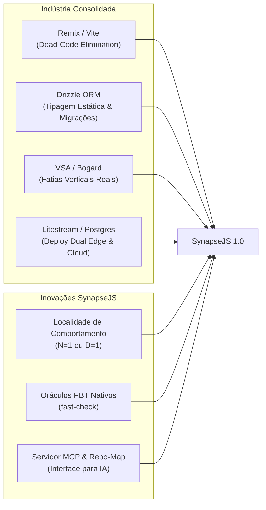

# SynapseJS 1.0 — Plano Mestre de Evolução Arquitetural
> **Diretriz Estratégica:** Não reinventar a roda. Unir os padrões consolidados da indústria (Remix, Drizzle, Vite, VSA) com as inovações originais do SynapseJS (Localidade Radical para Agentes, Invariantes Verificáveis por Oráculos e Contratos Máquina-Nativos) para transformar o projeto em um framework de produção viável, escalável e de classe mundial.

---

## 1. Visão Executiva & Tese de Posicionamento

O ecossistema de software atual sofre com uma bifurcação:
* **Frameworks Convencionais (Next.js, NestJS, Remix):** Projetados para humanos navegando em árvores complexas de 6 camadas (`routes`, `controllers`, `services`, `repositories`, `dtos`, `views`). Para agentes autônomos de IA (Cursor, Devin, Claude Code, Antigravity), essa dispersão gera alucinação de caminhos, quebra de contratos entre camadas e alto consumo de contexto.
* **Tentativas "Agentic" Frágeis:** Projetos que tentam reinventar compiladores, bundlers e parsers de SQL do zero, gerando ferramentas instáveis e inseguras.

### O Verdadeiro Diferencial do SynapseJS
O SynapseJS deve ocupar o posto definitivo de:
> **"O Framework Fullstack de Fatias Verticais Nativamente Projetado para Desenvolvimento Autônomo por Agentes de IA, com Verificação Determinística e Simplicidade Operacional para Humanos."**

---

## 2. Referências de Mercado: O que incorporar sem reinventar a roda



| Componente | Abordagem Antiga (Frágil) | Referência Consolidada | Como o SynapseJS 1.0 Adotará |
|---|---|---|---|
| **Isolamento Client/Server** | `slice-splitter.ts` manual com AST própria e Regex (`SERVER_ONLY_PATTERNS`) | **Remix / React Router v7 / Vite Plugin** | Criar um plugin oficial para Vite e Bun Bundler que aplica Dead-Code Elimination (DCE) baseado em AST padrão (`@babel/parser` ou `swc`), eliminando `action`, `loader` e queries do bundle do browser sem gerar arquivos sintéticos intermediários. |
| **Banco de Dados & DDL** | DDL cru em template strings (`CREATE TABLE...`) com parser de comentários | **Drizzle ORM** | Adoção do Drizzle como motor padrão de persistência. A fatia exporta sua tabela tipada (`sqliteTable` / `pgTable`). Geração de types estáticos sem ORMs pesados. |
| **Escopo de Fatias** | Dogma rígido de arquivo único ($N = 1$) que gera "God Files" em telas complexas | **Vertical Slice Architecture (Jimmy Bogard)** | Flexibilização híbrida: suportar $N = 1$ para features atômicas e $D = 1$ (diretório atômico) para features complexas. |
| **Orquestração de Agentes** | CLI com prints e MCP básico | **Anthropic MCP & Aider Repo-Map** | Turbinar o MCP Server com feedback de ciclo fechado (`test_slice`, `check_contract`, `diff_impact`). |
| **Escala & Deploy** | SQLite local em disco acoplado ao processo | **Fly.io / Litestream / PG-Boss** | Persistência dual: modo Single-Node ultraleve (SQLite + WAL + Litestream) e modo Cloud distribuído (PostgreSQL com PG-Boss). |

---

## 3. Os 5 Pilares da Nova Arquitetura

### Pilar 1: O Modelo Híbrido de Fatias Verticais ($N = 1$ e $D = 1$)
Nem toda funcionalidade cabe com elegância em um único arquivo de 100 linhas. Forçar um checkout de e-commerce em um arquivo contíguo cria "God Slices" de 2.000 linhas.

1. **Modo Atômico ($N = 1$):** Para CRUDs simples, mutações rápidas e componentes utilitários:
   ```text
   src/slices/tickets/create-ticket.slice.tsx
   ```
2. **Modo Diretório ($D = 1$):** Para features corporativas densas. Mantém a **localidade de comportamento** (tudo sobre a feature está na mesma pasta), mas separa responsabilidades para leitura humana e diffs limpos de Git:
   ```text
   src/slices/billing/generate-invoice/
     ├── schema.ts       # Contrato de entrada (TypeBox / Zod)
     ├── table.ts        # Definição Drizzle da tabela/views da feature
     ├── action.ts       # Lógica transacional, queries e integrações
     ├── view.tsx        # Componente React com hidratação limpa
     └── oracle.ts       # Testes de invariantes e PBT (fast-check)
   ```
O roteador de fatias (`slice-discovery.ts`) reconhecerá tanto `*.slice.tsx` quanto pastas `index.slice.tsx` ou estruturas de pasta com convenção padrão.

---

### Pilar 2: Camada de Dados Baseada em Drizzle ORM
Em vez de depender de strings SQL vulneráveis e de difícil refatoração:

```tsx
import { sqliteTable, text, integer } from 'drizzle-orm/sqlite-core';
import { Ok, Err, type Result, type ActionContext } from 'synapsejs';

// 1. Tabela Drizzle declarada na própria fatia (Localidade Mantida)
export const ticketsTable = sqliteTable('tickets', {
  id: text('id').primaryKey(),
  subject: text('subject').notNull(),
  priority: integer('priority').notNull(),
});

// 2. Action com autocompletion total e type-safety garantido
export async function createTicketAction(payload: TicketInput, ctx: ActionContext): Promise<Result<TicketOutput, TicketError>> {
  const [created] = await ctx.drizzle
    .insert(ticketsTable)
    .values({ id: crypto.randomUUID(), subject: payload.subject, priority: payload.priority })
    .returning();

  return Ok({ ticketId: created.id });
}
```
* **Migrações:** Executadas via Drizzle-Kit integrado diretamente no comando `synapse migrate`.
* **Zero Overhead:** O Drizzle compila para queries SQL puras com overhead quase nulo de runtime.

---

### Pilar 3: Plugin Oficial de Bundling (Substituindo o Splitter Artesanal)
O arquivo `slice-splitter.ts` atual tenta fazer parsing e emitir código para pastas intermediárias (`.synapse/artifacts`). Essa é a maior fonte de fragilidade técnica do projeto.

* **Novo Design:** Criar o `@synapsejs/bundler-plugin` (compatível com Vite e Bun).
* **Mecanismo de DCE (Dead-Code Elimination):**
  * Quando o alvo for **Client**, o plugin remove automaticamente identificadores marcados como servidor (`action`, `loader`, `table`, `schema`, `sliceTests`, referências a `ctx.drizzle`).
  * O mesmo ponto de chamada `createTicketAction(...)` no frontend vira um proxy HTTP RPC tipado que chama `POST /_synapse/rpc/<domain>/<name>`.
  * **Segurança Total:** Impossibilidade matemática de vazamento de credenciais ou código de backend para o bundle do browser.

---

### Pilar 4: Arquitetura de Deploy Dual (Edge / Single-Node & Multi-Node Cloud)

```text
               ┌────────────────────────────────────────────────────────┐
               │              SynapseJS Application Server              │
               └──────────────────────────┬─────────────────────────────┘
                                          │
                  ┌───────────────────────┴───────────────────────┐
                  ▼                                               ▼
         [Modo Single-Node]                              [Modo Cloud Multi-Node]
  Ideal para SaaS bootstrapping / VPS              Ideal para Kubernetes / Auto-scaling
  ┌────────────────────────────────┐              ┌─────────────────────────────────┐
  │ - SQLite local com WAL ativado │              │ - PostgreSQL Centralizado       │
  │ - Background Queue em SQLite   │              │ - Background Queue via PG-Boss  │
  │ - Replicação contínua para S3  │              │ - Redis para PubSub / Sessões   │
  │   via Litestream (RPO ~1s)     │              │ - Múltiplas réplicas sem lock   │
  └────────────────────────────────┘              └─────────────────────────────────┘
```

1. **Adapter Interface:** O `ActionContext` e o `SynapseServer` operam sobre abstrações de persistência e fila:
   * `ctx.db` / `ctx.drizzle`
   * `ctx.enqueue(job, payload)`
2. No ambiente local e em instâncias únicas, utiliza-se a eficiência bruta do SQLite do Bun com **Litestream** para backup contínuo sem manutenção.
3. Em clusters Kubernetes, ativa-se o driver de PostgreSQL com migrações centralizadas via lock de advisory do Postgres.

---

### Pilar 5: Ecossistema de Ciclo Fechado para Agentes de IA

Para agentes autônomos, o SynapseJS fornecerá o melhor ciclo de desenvolvimento do mercado:

1. **Protocolo MCP Avançado (`synapse mcp`):**
   * `synapse_list_slices`: Lista todas as fatias com domínios, rotas e dependências.
   * `synapse_get_slice_contract(sliceName)`: Retorna o contrato estrito em JSON (schema de entrada, resposta, roles RBAC).
   * `synapse_test_slice(sliceName)`: Executa os oráculos PBT apenas daquela fatia em menos de 100ms.
   * `synapse_scaffold(domain, name, pattern)`: Cria a fatia completa com testes e schemas pré-configurados.
2. **Oráculos PBT com `fast-check`:**
   * Toda fatia gerada traz um oráculo de teste por propriedades (`cases: [{ name, run }]`). O agente de IA consegue validar 100 variações de entrada (strings nulas, caracteres especiais, injeções) localmente antes de submeter uma alteração.
3. **Repo-Map Semântico Atualizado:**
   * O `.codebase/repo-map.d.ts` continua sendo gerado por AST, provendo ao LLM a visão global do sistema consumindo menos de 5% de sua janela de contexto.

---

## 4. Roteiro de Execução (Roadmap de Transição)

### 📌 Milestone 1: Resiliência da Base & Estabilização (Concluído)
- [x] Eliminação de falsos verdes em testes e migrações.
- [x] Timeouts calibrados e resolução limpa de subprocessos no Bun (`lifecycle-health`).
- [x] Tagged SQL seguro (`db.sql` e `db.sqlOne`).
- [x] Webhook Gateway com preservação de `rawBody: Uint8Array` para HMAC.
- [x] Multi-tenancy B2B determinístico (`requireTenant`).
- [x] DAG de migrações com ordenação topológica de dependências.

### 📌 Milestone 2: Flexibilização $N = 1$ e $D = 1$ (Próximo Passo)
- [ ] Atualizar `slice-discovery.ts` para reconhecer pastas de fatia (`src/slices/<domain>/<name>/index.slice.tsx` ou arquivos decompostos).
- [ ] Atualizar o CLI `synapse new-slice --dir` para permitir scaffolding de diretórios atômicos.
- [ ] Garantir que o repositório de mapas (`repo-map.d.ts`) indexe fatias em pasta com a mesma fidelidade.

### 📌 Milestone 3: Drizzle ORM como Motor Nativo
- [ ] Adicionar suporte a tabelas Drizzle no `ActionContext` (`ctx.drizzle`).
- [ ] Integrar `drizzle-kit generate` e `drizzle-kit migrate` ao comando `synapse migrate`.
- [ ] Manter compatibilidade com `db.sql` direto para queries legadas ou customizadas.

### 📌 Milestone 4: Plugin de Bundling & Descarte do Splitter Artesanal
- [ ] Implementar `@synapsejs/vite-plugin` utilizando transformações AST padrão para Dead-Code Elimination.
- [ ] Descontinuar o uso de regex (`SERVER_ONLY_PATTERNS`) para prevenção de vazamento.
- [ ] Suporte a Hot Module Replacement (HMR) transparente no desenvolvimento.

### 📌 Milestone 5: Publicação Oficial & Lançamento v1.0.0
- [ ] Executar ensaio de publicação ponta a ponta (`bun run rehearse:publish`).
- [ ] Publicar no npm sob o namespace `@synapsejs/core` e `synapsejs`.
- [ ] Criar documentação interativa com template de inicialização rápida (`bun create synapse-app`).

---

## 5. Conclusão

O SynapseJS não precisa reinventar bundlers ou ORMs para ser revolucionário. Sua verdadeira força está na **organização do código centrada em fatias atômicas e na interface máquina-nativa para IA**.

Ao abraçar os melhores padrões da indústria onde eles já são insuperáveis e focar 100% de sua energia na **experiência do desenvolvedor e na autonomia do agente**, o SynapseJS se tornará a stack mais produtiva, segura e elegante do ecossistema TypeScript moderno.
